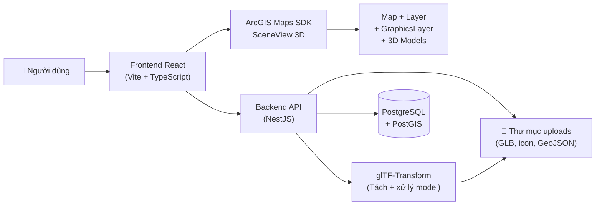
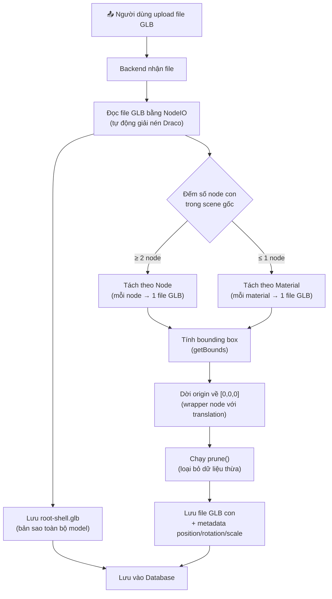
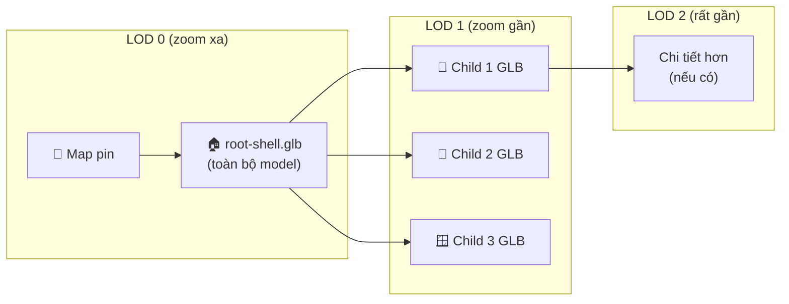

# BÁO CÁO CÔNG NGHỆ HIỂN THỊ MÔ HÌNH 3D TRÊN BẢN ĐỒ

> **Dự án:** Web GIS 3D — Quản lý và hiển thị mô hình 3D trên bản đồ  
> **Ngày lập:** 22/06/2026  
> **Công nghệ chính:** ArcGIS Maps SDK for JavaScript, React, NestJS, glTF-Transform

---

## Mục lục

1. [Mục tiêu của dự án](#1-mục-tiêu-của-dự-án)
2. [Kiến trúc tổng quan hệ thống](#2-kiến-trúc-tổng-quan-hệ-thống)
3. [Công nghệ frontend](#3-công-nghệ-frontend)
4. [Công nghệ backend](#4-công-nghệ-backend)
5. [Cách dự án hiển thị dữ liệu trên bản đồ](#5-cách-dự-án-hiển-thị-dữ-liệu-trên-bản-đồ)
6. [Cách dự án hiển thị mô hình 3D](#6-cách-dự-án-hiển-thị-mô-hình-3d)
7. [Cơ chế tách mô hình 3D thành mô hình con](#7-cơ-chế-tách-mô-hình-3d-thành-mô-hình-con)
8. [Cơ chế LOD và hiệu năng hiển thị](#8-cơ-chế-lod-và-hiệu-năng-hiển-thị)
9. [Slice Widget / lát cắt mô hình 3D](#9-slice-widget--lát-cắt-mô-hình-3d)
10. [Khả năng tương tác với mô hình](#10-khả-năng-tương-tác-với-mô-hình)
11. [Khả năng minh họa hiện tại của bản đồ 3D](#11-khả-năng-minh-họa-hiện-tại-của-bản-đồ-3d)
12. [Giới hạn hiện tại](#12-giới-hạn-hiện-tại)
13. [Đề xuất cải thiện](#13-đề-xuất-cải-thiện)
14. [Kết luận](#14-kết-luận)
15. [Bảng tổng hợp công nghệ](#15-bảng-tổng-hợp-công-nghệ)
16. [Giải thích thuật ngữ](#16-giải-thích-thuật-ngữ)
17. [Nhận xét cho nhiệm vụ khảo sát](#17-nhận-xét-cho-nhiệm-vụ-khảo-sát-khả-năng-hiển-thị-mô-hình-3d-trên-bản-đồ)

---

## 1. Mục tiêu của dự án

Dự án Web GIS 3D được xây dựng nhằm:

- **Quản lý dữ liệu không gian trên bản đồ:** cho phép tạo, sửa, xóa các layer GIS chứa dữ liệu điểm (Point), đường (LineString), vùng (Polygon) trên bản đồ trực tuyến.
- **Hiển thị layer GIS:** dữ liệu GeoJSON được nạp vào ArcGIS SceneView dưới dạng GeoJSONLayer với khả năng phân loại theo màu, icon và kiểu hiển thị.
- **Hiển thị entity độc lập:** các đối tượng không gian (Spatial Entity) không thuộc layer nào vẫn được hiển thị bằng map pin hoặc mô hình GLB riêng.
- **Hiển thị mô hình 3D trên nền bản đồ:** file GLB/glTF được upload qua backend, sau đó frontend load về và đặt lên bản đồ 3D bằng ArcGIS symbol layer kiểu `object`.
- **Cho phép người dùng tương tác:** xem, chọn (click), highlight, inspect thông tin mô hình 3D hoặc entity trên bản đồ.
- **Xem xét khả năng minh họa công trình 3D:** dự án hỗ trợ scene 3D nhiều tầng (root / child), tách mô hình con, lát cắt (Slice), vẽ polygon extrude và vùng nền minh họa.

---

## 2. Kiến trúc tổng quan hệ thống

Hệ thống hoạt động theo mô hình client-server:



**Giải thích luồng hoạt động:**

1. **Người dùng** thao tác trên giao diện web (tạo layer, upload model, click bản đồ…).
2. **Frontend React** gửi yêu cầu tới **Backend API** (NestJS) qua REST API.
3. **Backend** xử lý nghiệp vụ: lưu metadata vào **PostgreSQL + PostGIS**, upload file vào **thư mục uploads**, tách mô hình GLB bằng **glTF-Transform**.
4. **Frontend** nhận dữ liệu trả về (URL file GLB, tọa độ, scale, rotation…) và nạp vào **ArcGIS SceneView** để hiển thị trên bản đồ 3D.
5. Người dùng có thể click, highlight, inspect, chỉnh sửa transform (vị trí, xoay, kích thước) mô hình trực tiếp trên bản đồ.

---

## 3. Công nghệ frontend

### 3.1. React (v19)

- **Là gì:** Thư viện JavaScript phổ biến nhất để xây dựng giao diện người dùng (UI) theo mô hình component.
- **Dự án dùng ở đâu:** Toàn bộ giao diện web được viết bằng React: component `MapScene`, `MapControls`, các feature panel (LayerManager, ModelManager, SceneManager, EntityInspector, SliceManipulator, ThreeDEditor, FeatureManager).
- **Vai trò:** React quản lý vòng đời giao diện, re-render khi state thay đổi. Mỗi khi người dùng bật/tắt layer, chọn model, click bản đồ… React tự động cập nhật UI.

### 3.2. TypeScript

- **Là gì:** Ngôn ngữ mở rộng của JavaScript với kiểu dữ liệu tĩnh, giúp phát hiện lỗi khi viết code thay vì khi chạy.
- **Dự án dùng ở đâu:** Toàn bộ mã nguồn frontend (`.tsx`, `.ts`). Các type/interface chính nằm trong thư mục `src/types/`: `BackendLayer`, `BackendSpatialEntity`, `BackendScene3D`, `SceneNode`, `BackendModel3D`.
- **Vai trò:** Đảm bảo dữ liệu truyền giữa frontend và backend khớp nhau. Ví dụ `BackendSpatialEntity` định nghĩa rõ một entity có `scaleX`, `scaleY`, `scaleZ`, `rotationZ`, `modelUrl`… giúp code không bị sai kiểu dữ liệu.

### 3.3. Redux Toolkit (State Management)

- **Là gì:** Thư viện quản lý trạng thái (state) tập trung cho ứng dụng React, giúp đồng bộ dữ liệu giữa nhiều component.
- **Dự án dùng ở đâu:** File `src/store/mapSlice.ts` chứa toàn bộ state của bản đồ: layers, entities, basemap, terrain, editor tool, slice settings, scene interaction, LOD levels, inspected entity…
- **Vai trò:** Mọi thao tác trên bản đồ đều đi qua Redux store. Ví dụ khi người dùng bật Slice Widget, action `setEditorSliceEnabled(true)` được dispatch, MapScene nhận state mới và bật Slice trong ArcGIS. Điều này đảm bảo giao diện panel bên phải và bản đồ bên trái luôn đồng bộ.

### 3.4. ArcGIS Maps SDK for JavaScript (v5)

- **Là gì:** Bộ SDK chính thức của Esri để xây dựng ứng dụng bản đồ 2D/3D trên web. Đây là **lõi hiển thị** của dự án.
- **Dự án dùng ở đâu:** Import trực tiếp trong `MapScene.tsx`:
  - `@arcgis/core/views/SceneView`
  - `@arcgis/core/Map`
  - `@arcgis/core/layers/GeoJSONLayer`
  - `@arcgis/core/layers/GraphicsLayer`
  - `@arcgis/core/layers/BuildingSceneLayer`
  - `@arcgis/core/layers/SceneLayer`
  - `@arcgis/core/widgets/Slice`
  - `@arcgis/core/widgets/Sketch/SketchViewModel`
  - `@arcgis/core/geometry/*` (Point, Polygon, Polyline, Extent)
  - `@arcgis/core/geometry/geometryEngine`
  - `@arcgis/core/Graphic`
- **Vai trò:** ArcGIS SDK chịu trách nhiệm **toàn bộ việc render bản đồ 3D**, bao gồm: hiển thị basemap, terrain, layer GIS, mô hình GLB, xử lý click/hitTest, highlight, slice, sketch…

### 3.5. SceneView

- **Là gì:** View 3D của ArcGIS, cho phép xem bản đồ ở góc nghiêng 3 chiều (có thể xoay, nghiêng camera, có khái niệm "cao độ").
- **Dự án dùng ở đâu:** Khởi tạo trong `MapScene.tsx` dòng 415–420, với center tại `[105.78, 10.04]` (khu vực Việt Nam), camera tilt 60°.
- **Vai trò:** SceneView là **điều kiện tiên quyết** để hiển thị mô hình 3D. Khác với MapView (2D), SceneView cho phép đặt object 3D, nhìn từ trên xuống hoặc ngang, có terrain (địa hình), và hỗ trợ elevation.

### 3.6. Map

- **Là gì:** Đối tượng quản lý basemap (bản đồ nền) và ground (mặt đất/địa hình).
- **Dự án dùng ở đâu:** Khởi tạo tại dòng 398–400, basemap là `arcgis/streets` (nếu có API key) hoặc `osm` (OpenStreetMap).
- **Vai trò:** Map chứa tất cả các layer (GeoJSON, GraphicsLayer, BuildingSceneLayer…). Ground có thể là `world-elevation` (có địa hình thực), `world-topobathymetry` (bao gồm đáy biển) hoặc `flat` (phẳng). Điều này ảnh hưởng tới cách mô hình 3D bám mặt đất.

### 3.7. GeoJSONLayer

- **Là gì:** Loại layer của ArcGIS cho phép hiển thị dữ liệu GeoJSON (chuẩn mở mô tả dữ liệu địa lý) trực tiếp trên bản đồ.
- **Dự án dùng ở đâu:** Trong file `src/layers/backendLayer.ts`, hàm `createBackendLayer()` tạo GeoJSONLayer từ dữ liệu backend.
- **Vai trò:** Dùng để hiển thị layer GIS dạng điểm, đường, vùng. Hỗ trợ elevation (`relative-to-ground` với expression `$feature.elevation`), renderer (symbol, màu sắc), popup template.

### 3.8. GraphicsLayer

- **Là gì:** Layer linh hoạt nhất của ArcGIS, cho phép thêm/xóa từng Graphic riêng lẻ (mỗi Graphic gồm geometry + symbol + attributes).
- **Dự án dùng ở đâu:** MapScene khởi tạo **6 GraphicsLayer** riêng biệt:
  - `editorModelLayer`: chứa mô hình GLB do người dùng đặt từ editor (elevationInfo: `absolute-height`)
  - `editorExtrudeLayer`: chứa khối extrude 3D (elevationInfo: `relative-to-ground`)
  - `editorGroundLayer`: chứa polygon phẳng trên mặt đất (elevationInfo: `on-the-ground`)
  - `sceneLodLayer`: chứa mô hình 3D của scene (root + child, elevationInfo: `absolute-height`)
  - `positioningPinsLayer`: map pin đại diện entity/scene khi zoom xa (elevationInfo: `relative-to-ground`, maxScale: 2500)
  - `independentModelLayer`: mô hình GLB của entity độc lập (elevationInfo: `relative-to-ground`, minScale: 2500)
- **Vai trò:** GraphicsLayer là nơi mô hình GLB thực sự được đặt lên bản đồ, bằng cách tạo Graphic với symbol kiểu `point-3d` → `object`.

### 3.9. Point, Polygon, Polyline, Extent

- **Là gì:** Các lớp hình học (geometry) cơ bản của ArcGIS:
  - **Point:** một điểm (kinh độ, vĩ độ, cao độ)
  - **Polygon:** vùng đa giác (dùng cho mặt bằng, khu vực)
  - **Polyline:** đường (dùng tính khoảng cách)
  - **Extent:** hình chữ nhật bao quanh (dùng zoom tới phạm vi layer)
- **Dự án dùng ở đâu:** Point dùng để đặt mô hình 3D/map pin; Polygon dùng cho extrude và ground; Extent dùng để zoom tới phạm vi tổng hợp của layer.
- **Vai trò:** Tất cả mô hình 3D đều được đặt tại một **Point** (longitude, latitude, z). Polygon được dùng cho extrude (khối nổi 3D) hoặc ground (mặt phẳng).

### 3.10. geometryEngine

- **Là gì:** Module tính toán hình học phía client, không cần gửi lên server.
- **Dự án dùng ở đâu:** Hàm `polygonMetrics()` trong MapScene:
  - `geometryEngine.geodesicArea()`: tính diện tích polygon (mét vuông)
  - `geometryEngine.geodesicLength()`: tính chu vi/chiều dài (mét)
- **Vai trò:** Cung cấp thông tin diện tích, khoảng cách cho vùng polygon hoặc extrude mà người dùng vẽ trên bản đồ.

### 3.11. SketchViewModel

- **Là gì:** Công cụ vẽ và chỉnh sửa graphic trên bản đồ, hỗ trợ tạo polygon, di chuyển, xoay, thay đổi kích thước object 3D.
- **Dự án dùng ở đâu:** Hai instance:
  1. Trong `MapScene.tsx` (dòng 488–510): dùng cho editor 3D (đặt model, vẽ extrude, vẽ ground polygon).
  2. Trong `useSceneEditor.ts`: dùng riêng cho chế độ chỉnh sửa scene (transform scene root/child).
- **Vai trò:** SketchViewModel cho phép người dùng:
  - Click trên bản đồ để đặt mô hình GLB (`place-model`).
  - Vẽ polygon rồi extrude thành khối 3D (`draw-extrude`).
  - Vẽ polygon phẳng trên mặt đất (`draw-ground`).
  - Kéo/xoay/scale mô hình đã đặt (`update` → `transform`).
  - Chỉnh sửa vị trí/xoay/scale scene node (`useSceneEditor`).

### 3.12. Slice Widget

- **Là gì:** Widget chính thức của ArcGIS dùng để tạo mặt phẳng cắt (lát cắt) qua mô hình 3D, giúp nhìn vào bên trong công trình.
- **Dự án dùng ở đâu:** Khởi tạo trong MapScene (dòng 732–738), điều khiển bằng state: `editorSliceEnabled`, `editorSliceHeading`, `editorSliceTilt`, `editorSliceExcludeDoors`, `editorSliceDoorsRed`.
- **Vai trò:** Cho phép minh họa lát cắt ngang/dọc qua mô hình 3D, hỗ trợ xoay heading và tilt mặt cắt, loại trừ sublayer (ví dụ Doors), đổi màu sublayer.

---

## 4. Công nghệ backend

### 4.1. NestJS

- **Là gì:** Framework Node.js dùng để xây dựng API server có cấu trúc, hỗ trợ module, dependency injection, decorator.
- **Dự án dùng ở đâu:** Toàn bộ backend (`backend/src/`), chia thành 4 module chính:
  - **Layers module** (`layers/`): quản lý layer GIS, upload GeoJSON, model, icon.
  - **Spatial Entities module** (`spatial-entities/`): quản lý entity không gian (CRUD, upload model, upload image).
  - **Model 3D module** (`model-3d/`): quản lý thư viện mô hình 3D (upload, CRUD metadata).
  - **Scenes module** (`scenes/`): quản lý scene 3D, tách mô hình, ghim (placement).
- **Vai trò:** Backend **không trực tiếp render bản đồ**. Backend là API server chuẩn bị dữ liệu:
  - Lưu metadata (tọa độ, scale, rotation) vào database.
  - Lưu file GLB/icon/GeoJSON vào thư mục `uploads/`.
  - Tách mô hình GLB thành root shell + model con.
  - Trả về URL file và metadata cho frontend.

### 4.2. TypeORM + PostgreSQL + PostGIS

- **Là gì:** TypeORM là ORM (Object-Relational Mapper) cho TypeScript; PostgreSQL là cơ sở dữ liệu quan hệ; PostGIS là extension hỗ trợ dữ liệu không gian.
- **Dự án dùng ở đâu:**
  - Entity `SpatialEntity`: lưu geometry dạng PostGIS (`type: 'geometry', srid: 4326`), elevation, scale (X/Y/Z), rotation (X/Y/Z), assetUrl, modelUrl, metadata JSONB.
  - Entity `Scene3D`: lưu position/rotation/scale dạng JSONB, fileUrl, lodLevel, quan hệ cha-con (parent/children), liên kết entities.
  - Entity `Layer`: lưu metadata layer GIS.
  - Entity `Model3D`: lưu thông tin thư viện mô hình.
- **Vai trò:** Lưu trữ tất cả metadata cần thiết để frontend đặt mô hình đúng vị trí trên bản đồ.

### 4.3. @gltf-transform/core + @gltf-transform/functions

- **Là gì:** Thư viện JavaScript chuyên xử lý file glTF/GLB (định dạng chuẩn mở cho mô hình 3D).
  - `NodeIO`: đọc/ghi file glTF/GLB.
  - `getBounds`: tính hộp bao (bounding box) của một node.
  - `flatten()`: làm phẳng cấu trúc node (merge transform vào vertex).
  - `prune()`: loại bỏ dữ liệu thừa (texture, material, accessor không dùng).
- **Dự án dùng ở đâu:** File `backend/src/scenes/model-processor.service.ts` — service xử lý tách mô hình.
- **Vai trò:** Là **công cụ cốt lõi** cho việc tách mô hình GLB thành nhiều model con. Chi tiết ở [Mục 7](#7-cơ-chế-tách-mô-hình-3d-thành-mô-hình-con).

### 4.4. Draco (KHRDracoMeshCompression)

- **Là gì:** Thuật toán nén mesh 3D do Google phát triển. Nhiều file GLB được xuất từ Blender hoặc các công cụ 3D có nén Draco để giảm dung lượng.
- **Dự án dùng ở đâu:** Trong `ModelProcessorService.getIO()`, NodeIO đăng ký extension `KHRDracoMeshCompression` kèm decoder/encoder từ package `draco3dgltf`.
- **Vai trò:** Cho phép backend đọc được file GLB có nén Draco. Khi tách model, backend giải nén Draco trước khi xử lý geometry.

### 4.5. File upload và thư mục uploads

- **Cơ chế:** Backend dùng Multer (thông qua `@nestjs/platform-express`) để nhận file upload. File được lưu vào:
  - `uploads/temp/`: file tạm khi upload
  - `uploads/{sceneId}/`: file root-shell.glb và các model con sau khi tách
  - `uploads/models/`, `uploads/layers/`: file model 3D và icon/GeoJSON của layer
- **Giới hạn:** File upload tối đa 100MB. Chỉ chấp nhận `.glb` hoặc `.gltf`.
- **Static serving:** NestJS dùng `@nestjs/serve-static` để phục vụ file từ thư mục `uploads/` ra URL `/uploads/...`.

### 4.6. Tóm tắt vai trò backend

> **Quan trọng:** Backend **không render bản đồ**. Backend chỉ:
> 1. Nhận file GLB từ người dùng.
> 2. Tách file GLB thành root shell + model con (nếu cần).
> 3. Lưu file vào `uploads/`.
> 4. Lưu metadata (position, rotation, scale) vào database.
> 5. Trả về URL file GLB + metadata qua REST API cho frontend.
> 
> Frontend nhận URL + metadata → nạp vào ArcGIS SceneView → hiển thị trên bản đồ.

---

## 5. Cách dự án hiển thị dữ liệu trên bản đồ

Dự án hiển thị **5 nhóm dữ liệu** chính:

### 5.1. Layer GIS (điểm, đường, vùng)

- Dữ liệu GeoJSON được nạp vào `GeoJSONLayer`.
- Mỗi layer có renderer (quy tắc hiển thị): symbol, màu sắc, icon.
- Layer dạng Point có thể hiển thị bằng:
  - Map pin (icon SVG) khi không có mô hình 3D.
  - Mô hình GLB khi có `modelUrl` (symbol kiểu `object`).
- Layer dạng LineString hiển thị bằng đường.
- Layer dạng Polygon hiển thị bằng vùng tô màu.
- `elevationInfo: relative-to-ground` + expression `$feature.elevation`: mỗi feature có thể có độ cao riêng.

### 5.2. Spatial Entity độc lập

- Entity không thuộc layer nào được lấy qua API `GET /api/spatial-entities?layerId=none`.
- Hiển thị bằng 2 layer riêng:
  - `positioningPinsLayer`: map pin khi zoom xa (maxScale = 2500).
  - `independentModelLayer`: mô hình GLB khi zoom gần (minScale = 2500).
- Mỗi entity có thể có `modelUrl` hoặc `assetUrl` dẫn tới file GLB.

### 5.3. Scene 3D (root scene)

- Dữ liệu scene được load từ API `GET /api/scenes?lodLevel=0`.
- Root scene hiển thị bằng `sceneLodLayer` (GraphicsLayer).
- Mỗi scene có `fileUrl` dẫn tới file `root-shell.glb`.
- Vị trí: `position.x` = longitude, `position.y` = latitude, `position.z` = elevation.

### 5.4. Scene child (model con)

- Khi người dùng chuyển LOD level > 0, frontend load children của root scene qua API `GET /api/scenes/{id}/children?minLod=1`.
- Mỗi child scene có `position` (offset so với parent) + `rotation` + `scale`.
- Frontend tính tọa độ tuyệt đối bằng cách chiếu offset lên hệ tọa độ kinh vĩ (xem hàm `projectChildOffset()`).

### 5.5. Map pin

- Map pin là icon SVG hình giọt nước (`getMapPinIcon()`), dùng để đại diện vị trí entity/scene khi zoom xa.
- Map pin giúp người dùng nhận biết vị trí mà không cần render mô hình 3D nặng.
- Khi zoom gần (scale < 2500), map pin ẩn đi, mô hình 3D chi tiết hiện ra.

### 5.6. Tóm tắt cách dữ liệu vào ArcGIS

| Loại dữ liệu | ArcGIS Layer | Kiểu symbol | Khi nào hiển thị |
|---|---|---|---|
| Layer GIS (Point) | GeoJSONLayer | icon / object 3D | Khi layer được chọn |
| Layer GIS (Line/Polygon) | GeoJSONLayer | line / fill | Khi layer được chọn |
| Entity độc lập (pin) | GraphicsLayer (positioningPins) | icon (map pin SVG) | Zoom xa (> scale 2500) |
| Entity độc lập (3D) | GraphicsLayer (independentModel) | object (GLB) | Zoom gần (< scale 2500) |
| Scene root | GraphicsLayer (sceneLod) | object (GLB) | LOD level = 0 |
| Scene child | GraphicsLayer (sceneLod) | object (GLB) | LOD level ≥ 1 |
| Editor model | GraphicsLayer (editorModel) | object (GLB) | Khi đặt từ editor |
| Extrude block | GraphicsLayer (editorExtrude) | polygon-3d extrude | Khi vẽ từ editor |
| Ground polygon | GraphicsLayer (editorGround) | polygon-3d fill | Khi vẽ từ editor |

---

## 6. Cách dự án hiển thị mô hình 3D

### 6.1. Định dạng file

- Mô hình 3D được lưu dưới dạng **GLB** (binary glTF) hoặc **glTF** (text + binary buffers).
- GLB là định dạng chuẩn công nghiệp: nhẹ, nén tốt, hỗ trợ mesh, material, texture, animation trong một file duy nhất.

### 6.2. Cách frontend nhận URL model

- Backend trả về field `modelUrl`, `assetUrl`, hoặc `fileUrl` dạng đường dẫn tương đối (`/uploads/scenes/{id}/root-shell.glb`).
- Frontend nối với `backendHost` (mặc định `http://localhost:3000`) để tạo URL đầy đủ.

### 6.3. Cách ArcGIS hiển thị model

Frontend tạo **symbol** kiểu `point-3d` với `symbolLayers` kiểu `object`:

```javascript
{
  type: "point-3d",
  symbolLayers: [{
    type: "object",
    resource: { href: "http://localhost:3000/uploads/scenes/.../model.glb" },
    height: 12,      // kích thước theo trục Z
    width: 12,       // kích thước theo trục X  
    depth: 12,       // kích thước theo trục Y
    heading: 0,      // xoay theo phương ngang (độ)
    tilt: 0,         // nghiêng
    roll: 0,         // lật
    anchor: "origin"  // hoặc "bottom"
  }]
}
```

Mô hình được gắn vào một **Graphic** có geometry là **Point** (longitude, latitude, z):

```javascript
new Graphic({
  geometry: new Point({
    longitude: 105.78,
    latitude: 10.04,
    z: 15  // độ cao (mét)
  }),
  symbol: modelSymbol,
  attributes: { id: "...", name: "Tòa nhà A" }
})
```

### 6.4. Tọa độ và kích thước

| Thuộc tính | Ý nghĩa | Ví dụ |
|---|---|---|
| `longitude`, `latitude` | Vị trí trên bản đồ | 105.78, 10.04 |
| `z` (elevation) | Độ cao so với mặt đất/mực nước biển | 15 mét |
| `width`, `depth`, `height` | Kích thước mô hình (pixel/mét tùy context) | 12 |
| `heading` | Xoay ngang (0° = Bắc, 90° = Đông) | 45° |
| `tilt` | Nghiêng trước/sau | 0° |
| `roll` | Lật trái/phải | 0° |

### 6.5. Chế độ elevationInfo

Dự án sử dụng **3 chế độ** elevationInfo cho các GraphicsLayer khác nhau:

| Chế độ | Ý nghĩa | GraphicsLayer áp dụng |
|---|---|---|
| `on-the-ground` | Mô hình luôn nằm bám sát mặt đất, bất kể giá trị z | editorGroundLayer |
| `relative-to-ground` | Giá trị z được cộng thêm vào độ cao địa hình tại vị trí đó. Nếu z = 0 thì mô hình nằm trên mặt đất | editorExtrudeLayer, positioningPinsLayer, independentModelLayer |
| `absolute-height` | Giá trị z là độ cao tuyệt đối so với mực nước biển. Mô hình không phụ thuộc địa hình | editorModelLayer, sceneLodLayer |

**Ví dụ dễ hiểu:**
- Một cái cây trên đồi dùng `relative-to-ground`: cây luôn đứng trên mặt đất bất kể đồi cao hay thấp.
- Một tòa nhà cần đặt chính xác dùng `absolute-height`: tòa nhà ở độ cao 50m so với mực nước biển, không bị ảnh hưởng bởi terrain.
- Một vùng tô màu nền đất dùng `on-the-ground`: vùng tô luôn dán sát mặt đất.

---

## 7. Cơ chế tách mô hình 3D thành mô hình con

Đây là tính năng **quan trọng nhất** của backend, nằm trong `ModelProcessorService`.

### 7.1. Tổng quan quy trình



### 7.2. Bước 1: Đọc file GLB

```
const io = new NodeIO()
  .registerExtensions([KHRDracoMeshCompression])
  .registerDependencies({
    'draco3d.decoder': await draco3d.createDecoderModule(),
    'draco3d.encoder': await draco3d.createEncoderModule(),
  });
const document = await io.read(sourceFilePath);
```

NodeIO tự động nhận diện và giải nén Draco nếu file có nén. Sau bước này, mọi mesh đều ở dạng "thô" (uncompressed).

### 7.3. Bước 2: Tạo root-shell.glb

Toàn bộ document (không tách) được ghi ra file `root-shell.glb`. File này là **bản sao nguyên vẹn** của model gốc, dùng làm LOD 0 (mức chi tiết thấp nhất khi zoom xa).

Trong phương thức `uploadAndPlaceGltf()`, trước khi lưu root shell, code chạy `flatten()` để làm phẳng cấu trúc node (merge các transform cha vào vertex con). Trong phương thức `splitGltf()`, root shell giữ nguyên cấu trúc gốc.

### 7.4. Bước 3: Tách theo Node (ưu tiên)

Nếu scene gốc có **≥ 2 node con** (ví dụ một file GLB xuất từ Blender có nhiều object), backend tách theo từng node:

1. Đọc lại file gốc cho mỗi node (để có bản sao sạch).
2. Giữ lại node thứ `i`, xóa (detach) tất cả node khác.
3. Tính **bounding box** (`getBounds()`) để xác định tâm (center) của node.
4. Tạo **wrapper node** với `translation = [-cx, -cy, -cz]` → dời origin về gần `[0,0,0]`.
5. Chạy `prune()` để loại bỏ texture, material, accessor không còn được dùng.
6. Ghi ra file GLB con.
7. Lưu metadata: `position = {x: cx, y: cy, z: cz}` (vị trí tương đối so với model gốc).

**Ví dụ dễ hiểu:**  
Một file GLB chứa một tòa nhà gồm 3 object: "Tường", "Cửa", "Mái". Backend sẽ tạo:
- `root-shell.glb` (toàn bộ tòa nhà)
- `Tuong.glb` (chỉ có tường, origin tại tâm của tường)
- `Cua.glb` (chỉ có cửa, origin tại tâm của cửa)
- `Mai.glb` (chỉ có mái, origin tại tâm của mái)

Metadata lưu lại tọa độ `position` để frontend biết đặt mỗi model con ở đâu so với root.

### 7.5. Bước 4: Fallback tách theo Material

Nếu scene gốc chỉ có **1 node** (hoặc 0 node), backend không tách theo node mà chuyển sang tách theo **material**:

1. Liệt kê tất cả material trong document.
2. Với mỗi material, đọc lại bản sao → xóa (dispose) tất cả primitive không dùng material đó → chỉ giữ lại geometry dùng material đó.
3. Tính bounding box, dời origin, prune, ghi file.

**Ví dụ dễ hiểu:**  
Một cái ghế có 2 material: "Gỗ" và "Kim loại". Backend tạo:
- `Go.glb` (mặt ghế, lưng ghế bằng gỗ)
- `Kim_loai.glb` (chân ghế bằng kim loại)

### 7.6. Tại sao cần dời origin?

Khi tách một phần nhỏ từ model lớn, origin (gốc tọa độ) của phần nhỏ có thể nằm rất xa geometry thực tế. Ví dụ: cái cửa ở góc phải tòa nhà có tọa độ gốc `[15, 0, 3]` mét trong hệ tọa độ model. Nếu không dời origin, khi ArcGIS render model con tại một Point trên bản đồ, cửa sẽ bị lệch.

**Giải pháp:** Backend tạo wrapper node với translation ngược lại (`[-15, 0, -3]`), đưa geometry cửa về gần `[0,0,0]`. Đồng thời lưu `position = {x: 15, y: 0, z: 3}` để frontend biết cần đặt model con lệch đúng khoảng đó so với root.

### 7.7. Giới hạn quan trọng của cơ chế tách

| Giới hạn | Giải thích |
|---|---|
| **Tách theo node không hiểu ngữ nghĩa** | Nếu một cái ghế được xuất từ Blender thành 5 object (4 chân + 1 mặt ghế), backend sẽ tách thành 5 model con. Backend không biết đây là "một cái ghế". |
| **Tách theo material có thể gộp/chia không mong muốn** | Nếu tường và sàn cùng material "Bê tông", chúng sẽ nằm trong cùng một model con. Nếu một cái bàn có 2 material (gỗ + kính), nó sẽ bị chia thành 2 model. |
| **Tổng dung lượng sau tách có thể lớn hơn file gốc** | Mỗi file con phải chứa riêng texture, material, metadata. File gốc nén Draco sẽ bị giải nén khi tách. |
| **Phụ thuộc cấu trúc file 3D từ công cụ tạo model** | Nếu file GLB không có cấu trúc node rõ ràng (ví dụ tất cả mesh nằm trong 1 node), việc tách sẽ không hiệu quả. |

---

## 8. Cơ chế LOD và hiệu năng hiển thị

### 8.1. LOD là gì?

**LOD (Level of Detail)** là kỹ thuật hiển thị mô hình với mức chi tiết khác nhau tùy khoảng cách nhìn:
- **Xa** → hiển thị đơn giản (pin, hoặc root shell).
- **Gần** → hiển thị chi tiết (model con).

### 8.2. Cách dự án implement LOD

Dự án hỗ trợ **3 LOD level** (0, 1, 2):



**Các thành phần liên quan trong code:**

| Thành phần | File | Vai trò |
|---|---|---|
| `SceneLodRenderer` | `features/Scene3D/SceneLodRenderer.ts` | Quản lý graphic cho từng scene node, tạo/cập nhật/ẩn hiện graphic theo LOD |
| `useSceneLodLoader` | `hooks/useSceneLodLoader.ts` | Hook load root scenes từ backend, tạo SceneLodRenderer, sync khi LOD thay đổi |
| `sceneLodLevelsBySceneId` | `store/mapSlice.ts` | State lưu LOD level hiện tại cho từng scene |
| `MODEL_DETAIL_SCALE` | `layers/backendLayer.ts` | Ngưỡng scale = 2500: pin hiện khi zoom xa, model hiện khi zoom gần |
| `positioningPinsLayer` | `MapScene.tsx` | GraphicsLayer hiển thị pin, maxScale = 2500 (chỉ hiện khi scale > 2500, tức zoom xa) |
| `independentModelLayer` | `MapScene.tsx` | GraphicsLayer hiển thị model, minScale = 2500 (chỉ hiện khi scale < 2500, tức zoom gần) |

### 8.3. Cách LOD hoạt động

1. **Mặc định (LOD 0):** Chỉ hiển thị root shell (hoặc pin ở xa). Root shell là file duy nhất, nhẹ hơn so với load tất cả model con.
2. **Khi người dùng chuyển LOD 1:** Frontend gọi API lấy children, `SceneLodRenderer` tạo graphic cho mỗi child, ẩn root shell, hiện các child.
3. **LOD 2:** Nếu child có children (cháu), load tiếp.

### 8.4. Lợi ích hiệu năng

- Giảm số lượng file GLB cần load cùng lúc.
- Pin SVG rất nhẹ (< 1KB), phù hợp khi có hàng trăm entity trên bản đồ.
- Root shell giúp có cái nhìn tổng quan mà không cần load từng phòng/tầng.
- Lazy loading: children chỉ được fetch khi người dùng yêu cầu.

---

## 9. Slice Widget / lát cắt mô hình 3D

### 9.1. Slice Widget là gì?

Slice Widget là **công cụ cắt hiển thị** của ArcGIS:
- Tạo một **mặt phẳng cắt** trong không gian 3D.
- Mọi phần mô hình nằm **phía trước** mặt phẳng sẽ bị ẩn đi.
- Phần nằm **phía sau** vẫn hiển thị bình thường.
- Giúp "nhìn vào bên trong" công trình, tòa nhà, nội thất.

**Ví dụ dễ hiểu:** Hãy tưởng tượng cắt ngang một tòa nhà bằng một tấm kính → bạn thấy được bố trí phòng, bàn ghế, cầu thang bên trong.

### 9.2. Cách dự án sử dụng Slice

**Khởi tạo:**
```javascript
const sliceWidget = new Slice({ view, visible: false });
sliceWidget.viewModel.tiltEnabled = true;
view.ui.add(sliceWidget, "top-right");
```

**Bật/tắt:**
- State `editorSliceEnabled` điều khiển bật/tắt.
- Khi bật: `sliceWidget.viewModel.start()` → người dùng click trên model để đặt mặt phẳng cắt.
- Khi tắt: `sliceWidget.viewModel.clear()` → xóa mặt phẳng cắt.

**Xoay mặt cắt:**
- `editorSliceHeading`: xoay ngang (0–360°).
- `editorSliceTilt`: nghiêng (0–180°).
- Code `applySliceRotation()` áp dụng heading/tilt lên shape của Slice.

**Loại trừ layer khỏi slice:**
- `editorSliceExcludeDoors`: nếu bật, sublayer "Doors" sẽ không bị cắt (cửa vẫn hiển thị đầy đủ).
- `editorSliceDoorsRed`: nếu bật, cửa sẽ đổi sang màu đỏ để phân biệt vùng không bị cắt.

### 9.3. Slice hoạt động tốt nhất với layer nào?

| Loại layer | Khả năng Slice |
|---|---|
| **BuildingSceneLayer** | ✅ Tốt nhất — ArcGIS thiết kế Slice chuyên cho layer này. Hỗ trợ sublayer (Doors, Walls, Floors…), exclude/highlight từng nhóm. |
| **SceneLayer** | ✅ Tốt — Slice hoạt động với SceneLayer (format I3S/3D Tiles). |
| **GraphicsLayer + GLB rời** | ⚠️ Hạn chế — GLB hiển thị dưới dạng object symbol, Slice có thể cắt nhưng không kiểm soát được sublayer. Kết quả tùy thuộc cách ArcGIS render. |

### 9.4. Lưu ý quan trọng

- **Slice KHÔNG sửa file GLB gốc.** Slice chỉ thay đổi cách **hiển thị** (clip) trong SceneView. File 3D vẫn nguyên vẹn.
- **Slice là công cụ minh họa, không phải công cụ tách model.** Slice giúp nhìn bên trong, không tạo ra file mới.
- **Slice phù hợp cho trình diễn:** giới thiệu công trình, khảo sát nội thất, minh họa cấu trúc tầng.

---

## 10. Khả năng tương tác với mô hình

### 10.1. Click và hitTest

- Khi người dùng click trên bản đồ, `view.hitTest(event)` được gọi.
- hitTest trả về danh sách graphic/feature bị chạm.
- Code ưu tiên tìm `entityId` hoặc `backendEntityId` trước → nếu có, fetch entity từ backend.
- Nếu click vào scene-child hoặc scene-root → tạo virtual entity từ scene data.

### 10.2. Inspect thông tin entity

- Khi tìm được entity, dispatch `setInspectedEntity(entity)` → panel EntityInspector hiển thị thông tin:
  - Tên, loại, tọa độ, elevation.
  - Scale (X/Y/Z), rotation (X/Y/Z).
  - URL model, ảnh đính kèm.
  - Metadata (LOD level, breadcrumb, parent scene…).

### 10.3. Highlight đối tượng được chọn

- Khi `inspectedEntity` thay đổi, code tìm graphic tương ứng trong các layer.
- Gọi `layerView.highlight(graphic)` để tô viền sáng (cyan, haloOpacity: 0.9, fillOpacity: 0.2).
- Highlight hoạt động trên cả GraphicsLayer (scene, editor, independent) và GeoJSONLayer.

### 10.4. Chỉnh sửa transform bằng SketchViewModel

- **Chế độ editor:** Người dùng bật editor → chọn model → kéo/xoay/scale trên bản đồ.
- **Chế độ scene edit:** Bật `sceneEditMode` → click scene node → SketchViewModel cho phép transform → khi hoàn tất, gọi API `PATCH /api/scenes/{id}/transform` để lưu vị trí mới.
- SketchViewModel hỗ trợ: enableRotation, enableScaling, enableZ (nâng hạ cao độ).

### 10.5. Đặt model bằng click

- Chọn tool `place-model` → cursor chuyển thành `crosshair`.
- Click trên bản đồ → tạo Graphic với model symbol tại vị trí click.
- Đồng thời gọi `createSpatialEntity()` để lưu entity mới vào backend.

### 10.6. Lưu lại transform

- Khi kéo/xoay/scale xong, `persistEditorGraphic()` gọi `updateSpatialEntity()` với:
  - `geometry: { type: "Point", coordinates: [lng, lat] }`
  - `elevation`: giá trị z
  - `scaleX`, `scaleY`, `scaleZ`: kích thước
  - `rotationZ`: hướng xoay

---

## 11. Khả năng minh họa hiện tại của bản đồ 3D

Dựa trên phân tích code, dự án hiện **có khả năng minh họa** các nội dung sau:

| Khả năng minh họa | Trạng thái | Ghi chú |
|---|---|---|
| Vị trí công trình trên bản đồ | ✅ Có | Dùng Point + map pin hoặc model GLB |
| Pin đại diện entity/scene | ✅ Có | Map pin SVG với màu sắc tùy chỉnh |
| Mô hình 3D độc lập | ✅ Có | GLB render bằng object symbol |
| Công trình hoặc scene 3D | ✅ Có | Root scene + child scenes |
| Các object con tách từ mô hình | ✅ Có | Backend tách → frontend load LOD |
| Highlight đối tượng | ✅ Có | Tô viền cyan khi click |
| Xem thông tin chi tiết khi click | ✅ Có | EntityInspector panel |
| Cắt lát để nhìn bên trong (Slice) | ✅ Có | Slice Widget với heading/tilt |
| Vẽ khối extrude minh họa | ✅ Có | Polygon-3d extrude từ editor |
| Vẽ vùng nền polygon | ✅ Có | Polygon-3d fill trên mặt đất |
| Đặt/chỉnh sửa model trên bản đồ | ✅ Có | SketchViewModel + backend persist |
| BuildingSceneLayer/SceneLayer | ✅ Có | Hỗ trợ URL service, sublayer Doors |
| Terrain/địa hình thực | ✅ Có | world-elevation, world-topobathymetry |
| Đổi basemap | ✅ Có | ArcGIS styles + OSM fallback |
| Placement mode (ghim scene) | ✅ Có | Upload + click đặt + confirm |
| Chọn tọa độ trên bản đồ | ✅ Có | Picking coordinate mode |

---

## 12. Giới hạn hiện tại

### 12.1. Hiệu năng

- **GLB lớn (> 20MB) có thể làm chậm trình duyệt.** ArcGIS phải parse, decode và render model trong WebGL. Trên máy yếu hoặc thiếu GPU, FPS có thể giảm nghiêm trọng.
- **Nhiều model con làm tăng request và dung lượng.** Nếu một scene có 50 node, backend tạo 50 file GLB + 1 root-shell. Tổng dung lượng có thể gấp 2–5 lần file gốc (do giải nén Draco, lặp texture/material).
- **Không có giới hạn số lượng model render cùng lúc.** Nếu bản đồ có 100 entity 3D đang hiển thị, tất cả đều load GLB.

### 12.2. Chất lượng tách model

- **Tách theo node chưa hiểu ngữ nghĩa:** Một cái ghế có thể bị tách thành 4 chân + 1 mặt + 1 lưng. Một tòa nhà có thể bị tách thành "Mesh_001", "Mesh_002"… nếu Blender không đặt tên node rõ.
- **Tách theo material có thể gộp hoặc chia không mong muốn:** Tất cả vật bê tông → cùng 1 file, dù là tường và sàn khác tầng. Một cái bàn gỗ-kính → 2 file riêng.
- **Không tách được theo tầng/phòng nếu file 3D không có cấu trúc phù hợp.** Backend chỉ nhìn node và material, không hiểu "tầng 1", "phòng 201", "ban công".

### 12.3. Slice

- **Slice không phải chỉnh sửa vật lý.** Slice chỉ clip hiển thị, không tạo ra file model mới.
- **Slice với GLB rời trong GraphicsLayer:** kết quả có thể không chính xác 100% tùy cách ArcGIS render object symbol.
- **Slice tốt nhất với BuildingSceneLayer:** dự án có hỗ trợ nhưng cần có service URL (ArcGIS Enterprise/Online).

### 12.4. Dữ liệu

- **GLB không tự có metadata GIS.** File GLB chỉ chứa mesh, material, texture. Metadata (tên phòng, mã tầng, loại đối tượng) phải do backend bổ sung.
- **Nếu file 3D từ Blender không có cấu trúc tốt,** việc tách và minh họa sẽ bị giới hạn.
- **hitTest phụ thuộc cách model được tách.** Click vào một graphic sẽ chọn toàn bộ model con đó (không chọn được một phần mesh bên trong).

### 12.5. So sánh GLB rời vs. SceneLayer/BuildingSceneLayer

| Tiêu chí | GLB rời (GraphicsLayer) | BuildingSceneLayer / SceneLayer |
|---|---|---|
| Dễ upload | ✅ Upload GLB trực tiếp | ❌ Cần publish qua ArcGIS |
| Tách model | Backend glTF-Transform | ArcGIS tự quản lý sublayer |
| Hiệu năng lớn | ⚠️ Chậm với model lớn | ✅ Tối ưu LOD tự động |
| Slice | ⚠️ Hạn chế | ✅ Tốt nhất |
| Metadata | ❌ Cần tự thêm | ✅ Có sẵn (BIM/IFC) |
| Phù hợp cho | Object nhỏ, đồ nội thất | Tòa nhà, công trình lớn |

---

## 13. Đề xuất cải thiện

> **Lưu ý:** Các đề xuất dưới đây chỉ là khuyến nghị, KHÔNG sửa code.

### 13.1. Chuẩn hóa quy trình xuất model

- Đặt tên node theo quy ước: `Building > Floor_01 > Room_101 > Desk_A`.
- Tách object theo ý nghĩa sử dụng (phòng, tầng, khu vực) thay vì mesh part.
- Xuất file GLB đã tối ưu: giảm polygon, nén texture, bật Draco.

### 13.2. Metadata semantic cho object

- Thêm metadata mô tả: loại đối tượng (cửa, tường, bàn, ghế), mã tầng, mã phòng, mã khu vực.
- Có thể dùng `custom properties` trong Blender hoặc thêm metadata sau khi upload.

### 13.3. Không tách mọi node thành entity

- Nếu node chỉ là mesh part (1 chân ghế), không nên tạo entity riêng.
- Cần logic lọc: chỉ tạo entity cho node có tên rõ nghĩa hoặc đủ lớn.

### 13.4. Tối ưu GLB trước khi upload

- Dùng tool: `gltf-transform optimize`, `gltfpack`, Blender Decimate.
- Nén texture (WebP/KTX2), giảm resolution texture.
- Draco compression cho mesh.

### 13.5. LOD nhiều cấp

- Tự động tạo LOD 0 (simplified mesh), LOD 1 (medium), LOD 2 (full detail).
- Có thể dùng mesh simplification algorithm tự động.

### 13.6. BuildingSceneLayer cho công trình lớn

- Với tòa nhà/công trình quy mô lớn (> 100MB), nên chuyển sang BuildingSceneLayer:
  - Tự quản lý LOD
  - Hỗ trợ Slice tốt nhất
  - Có sublayer (tường, cửa, sàn…)
  - Tối ưu hiệu năng tự động

### 13.7. Pipeline chuyển đổi

- Cân nhắc pipeline: GLB → 3D Tiles hoặc I3S (Scene Layer Package) nếu cần hiển thị quy mô lớn (thành phố, khu công nghiệp).

### 13.8. Benchmark

- Thêm thống kê: dung lượng file, số object, FPS khi render, thời gian load, số request.
- Giúp đánh giá hiệu năng và quyết định khi nào cần tối ưu.

---

## 14. Kết luận

### 14.1. Dự án CÓ khả năng hiển thị mô hình 3D trên bản đồ

Dự án đã triển khai thành công việc:
- Hiển thị file GLB/glTF trên bản đồ 3D ArcGIS.
- Quản lý scene nhiều tầng (root + children) với LOD.
- Tách mô hình lớn thành model con.
- Hỗ trợ đặt, xoay, scale mô hình trực tiếp trên bản đồ.
- Hỗ trợ lát cắt (Slice) để nhìn bên trong công trình.
- Click/highlight/inspect thông tin đối tượng.

### 14.2. ArcGIS SceneView là lõi hiển thị

Toàn bộ rendering 3D phụ thuộc vào ArcGIS Maps SDK: SceneView, Map, layer, symbol, hitTest, Slice, SketchViewModel. Đây là nền tảng mạnh, có cộng đồng lớn, hỗ trợ nhiều format.

### 14.3. Backend glTF processing giúp chuẩn bị model

`@gltf-transform/core` + `@gltf-transform/functions` + Draco cho phép backend đọc, tách, tối ưu file GLB mà không cần phần mềm 3D. Đây là điểm mạnh kỹ thuật của hệ thống.

### 14.4. Slice Widget giúp minh họa cắt lớp

Slice là công cụ minh họa hữu ích, đặc biệt khi kết hợp với BuildingSceneLayer. Với GLB rời, Slice vẫn hoạt động nhưng hạn chế hơn.

### 14.5. Giới hạn lớn nhất

| Giới hạn | Mức ảnh hưởng |
|---|---|
| Chất lượng/cấu trúc file 3D đầu vào | 🔴 Cao — quyết định chất lượng tách model |
| Hiệu năng GLB lớn | 🟡 Trung bình — ảnh hưởng UX trên máy yếu |
| Tách model chưa hiểu ngữ nghĩa | 🟡 Trung bình — cần chuẩn hóa đầu vào |
| Slice với GLB rời | 🟢 Thấp — vẫn hoạt động, chỉ hạn chế |

### 14.6. Hướng phù hợp

Kết hợp tối ưu: **Bản đồ GIS** + **Root scene (LOD 0)** + **LOD switching** + **Model con (LOD 1+)** + **Slice** + **Metadata semantic** = hệ thống minh họa 3D trên bản đồ đầy đủ chức năng.

---

## 15. Bảng tổng hợp công nghệ

| Công nghệ | Vị trí sử dụng | Vai trò | Ghi chú |
|---|---|---|---|
| React 19 | Frontend (toàn bộ UI) | Framework giao diện | Dùng hooks, functional component |
| TypeScript | Frontend + Backend | Kiểu dữ liệu tĩnh | Giảm lỗi runtime |
| Redux Toolkit | Frontend (`store/mapSlice.ts`) | State management | 1 slice lớn quản lý toàn bộ state |
| Vite | Frontend (build tool) | Dev server + bundler | Nhanh, HMR |
| ArcGIS Maps SDK v5 | Frontend (`@arcgis/core`) | Lõi hiển thị bản đồ 3D | SceneView, Map, Layer, Widget |
| SceneView | Frontend (`MapScene.tsx`) | View 3D cho bản đồ | Camera 3D, terrain, elevation |
| GeoJSONLayer | Frontend (`backendLayer.ts`) | Hiển thị dữ liệu GIS | Point, Line, Polygon |
| GraphicsLayer | Frontend (MapScene) | Hiển thị model/pin/extrude | 6 layer riêng biệt |
| SketchViewModel | Frontend (MapScene, useSceneEditor) | Vẽ/chỉnh sửa trên bản đồ | Place, transform, draw |
| Slice Widget | Frontend (MapScene) | Lát cắt hiển thị 3D | heading, tilt, exclude |
| BuildingSceneLayer | Frontend (MapScene) | Layer công trình BIM | Sublayer, Slice tốt nhất |
| SceneLayer | Frontend (MapScene) | Layer scene 3D (I3S) | Alternative cho building |
| geometryEngine | Frontend (MapScene) | Tính toán hình học | Diện tích, khoảng cách |
| NestJS | Backend (toàn bộ API) | API server | Module, DI, decorator |
| TypeORM | Backend (entities) | ORM database | Entity, Repository |
| PostgreSQL + PostGIS | Backend (database) | Lưu trữ dữ liệu + GIS | Geometry type, SRID 4326 |
| @gltf-transform/core | Backend (model-processor) | Đọc/ghi GLB | NodeIO, getBounds |
| @gltf-transform/functions | Backend (model-processor) | Xử lý GLB | flatten(), prune() |
| draco3dgltf | Backend (model-processor) | Giải nén Draco | Decoder + Encoder |
| Multer | Backend (controller) | Upload file | diskStorage, fileFilter |
| sharp | Backend (dependencies) | Xử lý ảnh | Thumbnail, resize |
| TailwindCSS v4 | Frontend (styling) | CSS utility framework | Responsive, dark mode |

---

## 16. Giải thích thuật ngữ

Dành cho người không chuyên sâu về lập trình 3D:

| Thuật ngữ | Giải thích dễ hiểu |
|---|---|
| **GLB** | File chứa mô hình 3D (hình dạng, màu sắc, vật liệu) trong một file duy nhất. Giống như file `.docx` chứa cả text lẫn hình ảnh. |
| **glTF** | Phiên bản text của GLB, gồm nhiều file (`.gltf` + `.bin` + textures). |
| **GIS** | Geographic Information System — hệ thống thông tin địa lý. Dùng để quản lý dữ liệu liên quan đến vị trí trên bản đồ. |
| **SceneView** | Khung nhìn 3D của ArcGIS. Giống như bạn đang nhìn qua cửa sổ máy bay xuống mặt đất, có thể xoay, nghiêng, zoom. |
| **Layer** | Một "lớp" dữ liệu chồng lên bản đồ. Ví dụ: lớp đường, lớp nhà, lớp cây xanh. Mỗi lớp hiển thị độc lập. |
| **Map pin** | Icon hình giọt nước 📍 đánh dấu vị trí trên bản đồ. Như ghim trên bản đồ giấy. |
| **LOD (Level of Detail)** | Mức chi tiết hiển thị. Xa thì thấy sơ, gần thì thấy rõ. Giống như nhìn tòa nhà từ xa chỉ thấy khối hộp, lại gần thấy cửa sổ, ban công. |
| **Slice** | Cắt lát hiển thị. Giống như cắt một quả cam làm đôi để nhìn bên trong. Slice không cắt thật, chỉ ẩn một nửa. |
| **Bounding box** | Hộp chữ nhật nhỏ nhất bao quanh một vật thể. Dùng để xác định tâm và kích thước vật thể. |
| **Metadata** | Dữ liệu mô tả dữ liệu. Ví dụ: tên phòng, mã tầng, loại vật liệu — không phải hình dạng 3D nhưng giúp hiểu ý nghĩa. |
| **Elevation** | Độ cao so với mặt đất hoặc mực nước biển. Đơn vị mét. |
| **Terrain** | Địa hình thực (đồi, núi, thung lũng). ArcGIS có thể hiển thị terrain thật từ dữ liệu vệ tinh. |
| **Basemap** | Bản đồ nền (đường, sông, tòa nhà sẵn có). Ví dụ: Google Maps, OpenStreetMap. |
| **Draco** | Thuật toán nén mesh 3D do Google phát triển. Giảm dung lượng file GLB nhưng cần giải nén khi sử dụng. |
| **hitTest** | Kiểm tra "chạm" — khi click trên bản đồ, kiểm tra xem click đúng vào object nào. |
| **Highlight** | Tô sáng — khi chọn một object, viền sáng lên để phân biệt với các object khác. |
| **Transform** | Biến đổi gồm 3 thành phần: vị trí (position), xoay (rotation), kích thước (scale). |
| **Extrude** | "Đùn" — vẽ một polygon phẳng rồi "đùn" lên cao thành khối 3D. Ví dụ: vẽ hình chữ nhật → đùn lên 15m → thành một khối hộp 3D. |
| **Node (trong glTF)** | Một "đơn vị" trong cấu trúc file 3D. Mỗi node có thể chứa mesh (hình dạng), transform, hoặc node con. |
| **Material** | Vật liệu — quy định màu sắc, độ bóng, texture của bề mặt 3D. Ví dụ: gỗ, kính, bê tông. |
| **Primitive (trong glTF)** | Một phần hình học cơ bản trong mesh, gắn với một material. Một mesh có thể có nhiều primitive. |

---

## 17. Nhận xét cho nhiệm vụ khảo sát khả năng hiển thị mô hình 3D trên bản đồ

### Kết quả khảo sát

Dự án Web GIS 3D **đã chứng minh khả năng hiển thị mô hình 3D trên bản đồ web** với các điểm nổi bật:

1. **Nền tảng vững chắc:** ArcGIS Maps SDK v5 cung cấp SceneView mạnh mẽ, hỗ trợ đầy đủ GLB, terrain, basemap, widget. Đây là SDK thương mại hàng đầu cho GIS 3D trên web.

2. **Quy trình end-to-end hoàn chỉnh:** Từ upload GLB → tách model → lưu metadata → load lên bản đồ → tương tác (click, highlight, inspect, edit) → lát cắt (Slice). Tất cả đều đã implement và hoạt động.

3. **Cơ chế LOD hợp lý:** Root scene + child scenes + map pin + model detail scale tạo ra hệ thống LOD đơn giản nhưng hiệu quả, giúp giảm tải khi zoom xa.

4. **Backend xử lý model thông minh:** glTF-Transform cho phép tách model mà không cần phần mềm 3D nặng. Hỗ trợ Draco, tự dời origin, tính bounding box.

5. **Slice Widget hữu ích cho minh họa:** Có thể nhìn bên trong công trình, xoay mặt cắt, loại trừ sublayer — phù hợp cho trình bày báo cáo kiến trúc/xây dựng.

### Khuyến nghị cho sử dụng thực tế

- **Chuẩn bị file 3D tốt** là yếu tố quan trọng nhất. File GLB có cấu trúc node rõ ràng (đặt tên theo phòng/tầng) sẽ cho kết quả tách tốt nhất.
- **Với công trình lớn (> 50MB):** nên dùng BuildingSceneLayer thay vì GLB rời.
- **Với object nhỏ (bàn, ghế, cây cảnh):** GLB rời trong GraphicsLayer là phù hợp.
- **Cần tối ưu texture và polygon** trước khi upload để đảm bảo hiệu năng.
- **LOD nên được mở rộng** thêm nhiều cấp tự động thay vì chỉ phụ thuộc vào cấu trúc scene cha-con.

### Đánh giá tổng thể

| Tiêu chí | Đánh giá |
|---|---|
| Khả năng hiển thị 3D trên bản đồ | ⭐⭐⭐⭐⭐ Đầy đủ |
| Tương tác với mô hình | ⭐⭐⭐⭐ Tốt |
| Tách model tự động | ⭐⭐⭐ Trung bình (phụ thuộc đầu vào) |
| Hiệu năng với model lớn | ⭐⭐⭐ Trung bình (cần tối ưu) |
| Slice / minh họa lát cắt | ⭐⭐⭐⭐ Tốt (tốt nhất với BuildingSceneLayer) |
| Tổng thể | ⭐⭐⭐⭐ Tốt — phù hợp cho mục đích khảo sát và minh họa |

---

> *Báo cáo được tạo tự động từ phân tích mã nguồn dự án. Không có code nào bị sửa đổi trong quá trình tạo báo cáo.*
